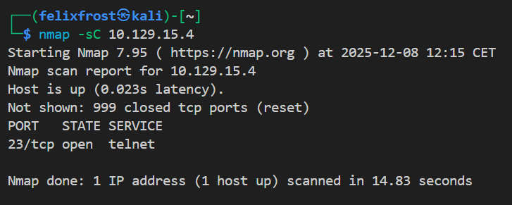
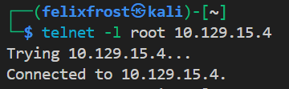

    Target: MEOW box
- [1. Executive summary](#1-executive-summary)
- [1. Enumeration](#1-enumeration)
- [2. Exploitation](#2-exploitation)
- [3. Privilege analysis](#3-privilege-analysis)
- [4. Loot \& Flags](#4-loot--flags)
- [5. Suggested remediation](#5-suggested-remediation)

**IP:** 10.129.15.4      
**OS:** Linux   
**Difficulty:** Very easy

## 1. Executive summary
A critical security vulnerability was identified in the target infrastructure. The system is configured to accept unencrypted remote connections (Telnet) without requiring any authentication. This allows any attacker on the local network to immediately gain administrative (Root) control of the server, leading to a complete loss of confidentiality and integrity

## 1. Enumeration 
* **Open Ports:**
    * 23 (telnet)
* **Steps:**
    * Ping target `ping 10.129.15.4`
    * Scan for open ports `nmap -sC 10.129.15.4`

    

## 2. Exploitation 

**Vulnerability:** Telnet port without authentication configuration set up.

**Steps to reproduce:**

Attempt to log in as root user `telnet -l root 10.129.15.4`               
  

Logged in as user, finding a file and seeing the contents:

 

## 3. Privilege analysis
**Current User:** `root`       
**Findings:**
    Possible to login as root user directly without password through telnet.

## 4. Loot & Flags
* **Flag:** `b40abdfe23665f766f9c61ecba8a4c19`

## 5. Suggested remediation

  **Either**
   * Disable telnet and enable SSH instead - It is an obsolete, unencrypted protocol.
   * Ensure the root account requires a strong password, or disable root login entirely.

